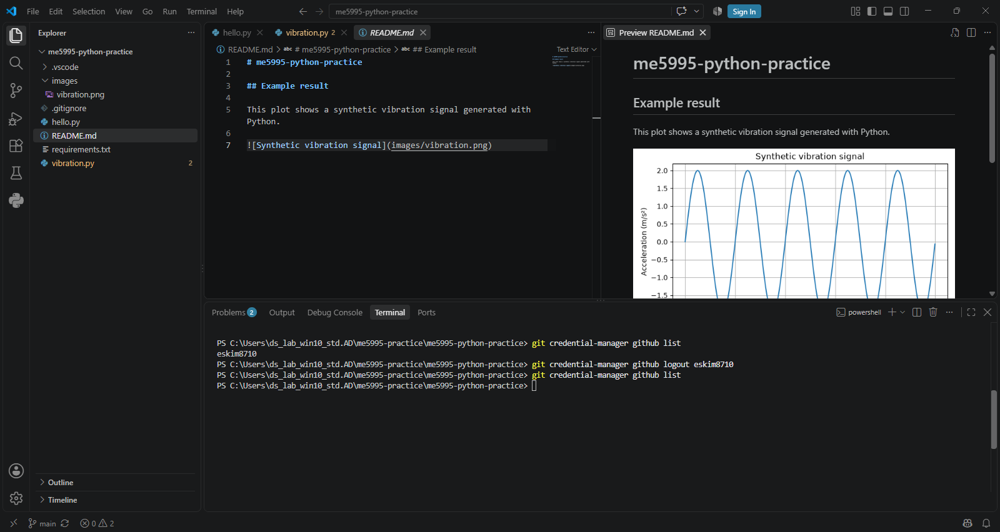
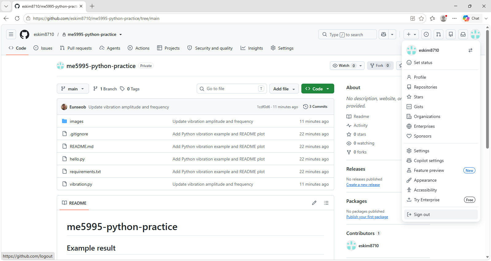
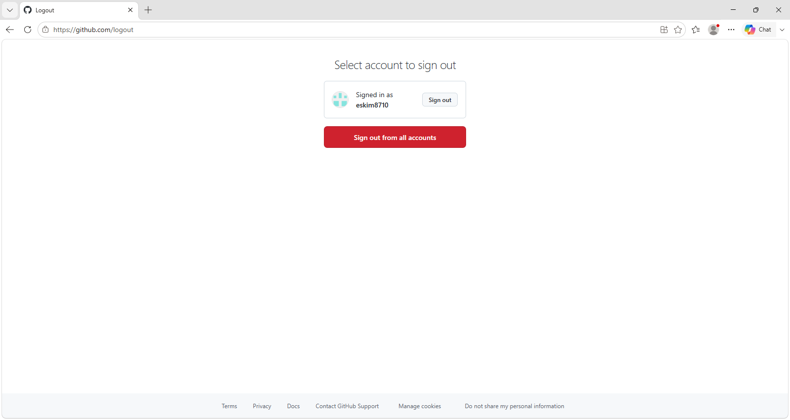
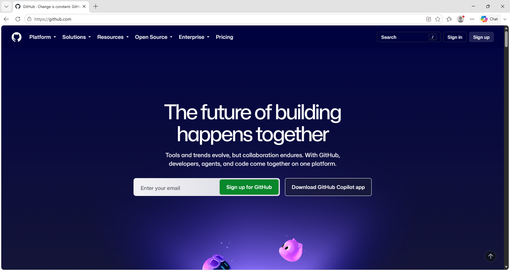

# Before Leaving the Classroom

**Git Credential Manager account logout and GitHub browser sign-out verified in the classroom on September 14, 2026.**

Use this page when you have finished using GitHub on a shared computer.
Do not shut down or restart the classroom PC.

## 1. Confirm your work is saved

For Practice A, in the project terminal, run `git status`. Confirm the branch is up to date with
`origin/main` and the working tree is clean. Also check the latest files and
graph on GitHub. Save any intentionally untracked personal files separately.

For Practice B, the graph in outputs/ is a local result and is not uploaded
to the course repository. Copy it to personal storage if you want to keep it.
Do not commit or push just to finish Practice B. If you did not sign in during
B and already signed out after A, you do not need to repeat account logout.

## 2. Remove your saved Git authentication

Git authentication and browser login are separate. First inspect the available
Git Credential Manager commands:

```powershell
git credential-manager github --help
git credential-manager github list
```

Identify **your own account**. Before using the logout command, check its help:

```powershell
git credential-manager github logout --help
```

If the help shows the username argument, replace the placeholder and run:

```powershell
git credential-manager github logout YOUR_GITHUB_USERNAME
git credential-manager github list
```

Confirm your account is no longer listed. Leave other people's accounts alone.
The screenshot shows the instructor's account before logout and an empty list afterward.



If the commands are unavailable or the account remains listed, ask the
instructor to review the output. Do not clear all Windows credentials.

## 3. Sign out in the browser







On GitHub, open your profile menu → **Sign out**, and select your account if
an account chooser appears. Confirm you are signed out. If you saved a GitHub
password or signed the browser into your own sync account, remove your saved
login/sign out of that account too; do not change other users' entries.

If you separately signed VS Code into GitHub, sign out of that account from
VS Code's Accounts menu as well. GCM browser authentication does not require
a separate VS Code sign-in.

Close your project and browser tabs. Saved local project files are separate
from account credentials; follow classroom instructions for their removal.
Do not rely on a later scheduled reset to sign out while leaving a shared
session accessible.

## Sources

- [GCM account management](https://github.com/git-ecosystem/git-credential-manager/blob/main/docs/multiple-users.md)
- [GitHub browser sign-out](https://docs.github.com/en/authentication/keeping-your-account-and-data-secure/switching-between-accounts#removing-accounts-from-the-account-switcher)

Sources reviewed September 14, 2026. The instructor performed the account logout on the classroom PC; the authoring assistant reviewed the screenshot.
