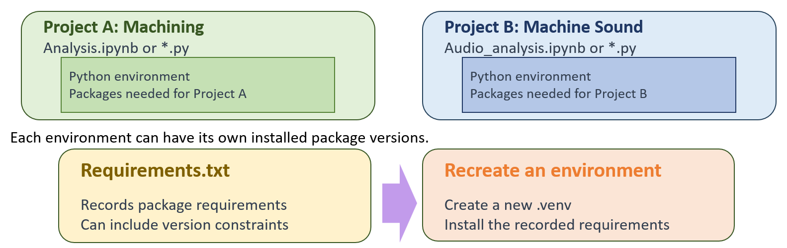

# Optional Reference — Virtual Environments

You can skip this page for Practice A and B. Their main instructions use the
installed Python and `pip --user`.

A virtual environment keeps one project's Python packages separate from other
projects. This is useful when projects need different package versions.
It is not a security sandbox.

## Why separate environments?



The machining and machine-sound projects in this illustration are hypothetical
examples, not Practice A and Practice B. The figure shows an optional isolated
environment workflow. Our main practices share the installed Python and user
packages; a requirements file by itself does not isolate them.

Use the filename `requirements.txt` as written in the commands below. It records
package requirements, but it does not by itself reproduce an entire environment
or guarantee identical results across computers.

## Windows example for a personal computer

Use this alternative only when you want a separate environment. In your
project folder, open PowerShell and run these commands one at a time:

```powershell
py -3.13 -m venv .venv
.\.venv\Scripts\Activate.ps1
python -c "import sys; print(sys.executable)"
python -m pip install -r requirements.txt
```

The Python path should end in `.venv\Scripts\python.exe` inside your project.
Use `python your_script.py` to run a file in the activated environment, replacing
`your_script.py` with its actual name. Use **Python: Select Interpreter** in VS
Code to select the same executable. Do not add `--user` inside this environment.
To leave it, run `deactivate`.

Keep `.venv/` out of Git and recreate it from your requirements when needed.
If a managed computer blocks creation or execution, follow the main guide
instead. Do not change its policies to follow this optional example.

## Official guides

- [Python: creating and using venv](https://docs.python.org/3.13/library/venv.html)
- [VS Code: Python environments and interpreter selection](https://code.visualstudio.com/docs/python/environments)
- [pip: user installations and their interaction with virtual environments](https://pip.pypa.io/en/stable/user_guide/#user-installs)

References reviewed September 14, 2026. This page is optional background;
classroom venv execution is not required or validated by the main walkthrough.
