# Practice A — Create and Share Your Python Project

**ME 5995 · Optional, ungraded step-by-step guide**

Follow these steps to run a Python script, put its graph in a README, and save
your project on GitHub. All code is provided. No answers or submission are required.
This walkthrough is for Windows laptops and classroom Windows PCs. macOS and Linux setup is not covered. Use Windows PowerShell throughout. Complete the [Windows setup](windows_setup.md)
first if you are using your own computer.

The screenshots show an instructor's personal practice account. Use **your own
GitHub account and repository address**. On classroom PCs, local files and
installed packages may disappear after the scheduled reset. Save your work to
GitHub before leaving. Do not shut down or restart the classroom computer.

## 1. Create your GitHub repository

1. Sign in to your own account at [GitHub](https://github.com/).
2. Use the **+** menu and choose **New repository**.
3. Enter `me5995-python-practice` as the name.
4. Choose **Private**, turn **Add README** on, and choose **Python** for `.gitignore`.
5. Leave the license choice at **No license** for this personal walkthrough.
6. Click **Create repository**.

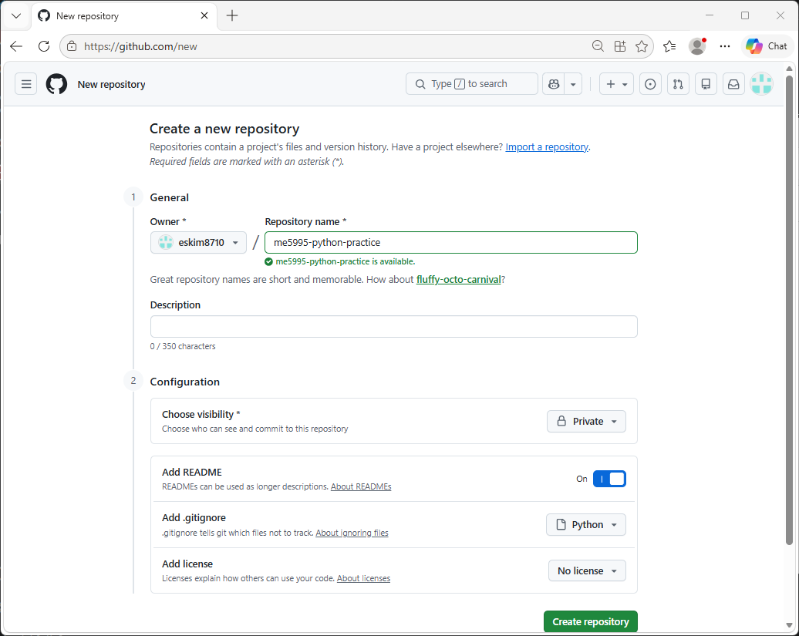

You should see `README.md` and `.gitignore` in your new repository.

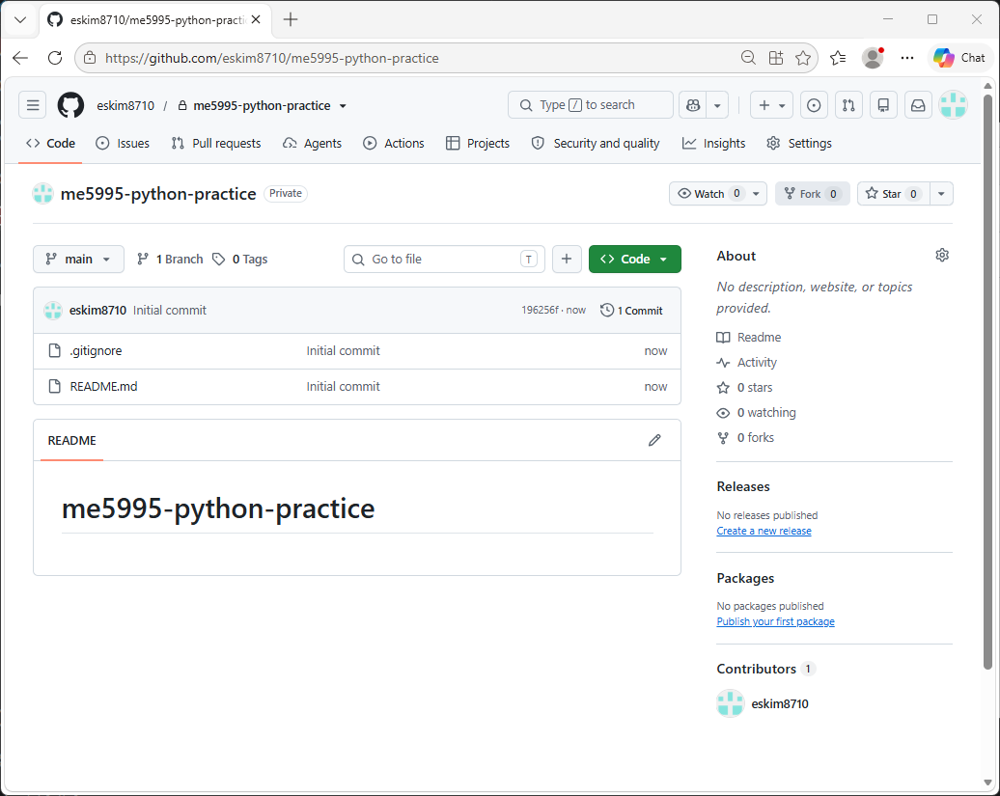

> **Returning after a classroom reset?** Your GitHub repository still exists.
> Skip repository creation and clone it again. Files you pushed will return
> with the clone. Do not repeat edits that are already in those files.

## 2. Clone and open it in VS Code

1. Open VS Code. Check that Microsoft's **Python** extension is installed;
   reinstall it if the classroom reset removed it.
2. Select **Terminal → New Terminal** and use PowerShell.
3. Run these commands one at a time:

```powershell
cd $env:USERPROFILE
New-Item -ItemType Directory -Force me5995-practice
cd me5995-practice
```

4. On your GitHub repository page, choose **Code → HTTPS** and copy the address.
5. Replace the example address below with your copied address, then run it:

```powershell
git clone https://github.com/YOUR_USERNAME/me5995-python-practice.git
```

6. If prompted, choose **Sign in with your browser** and sign in to the same
   GitHub account. Return to the terminal and wait for cloning to finish.

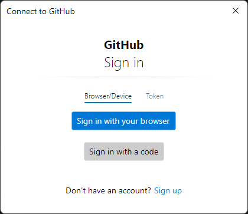

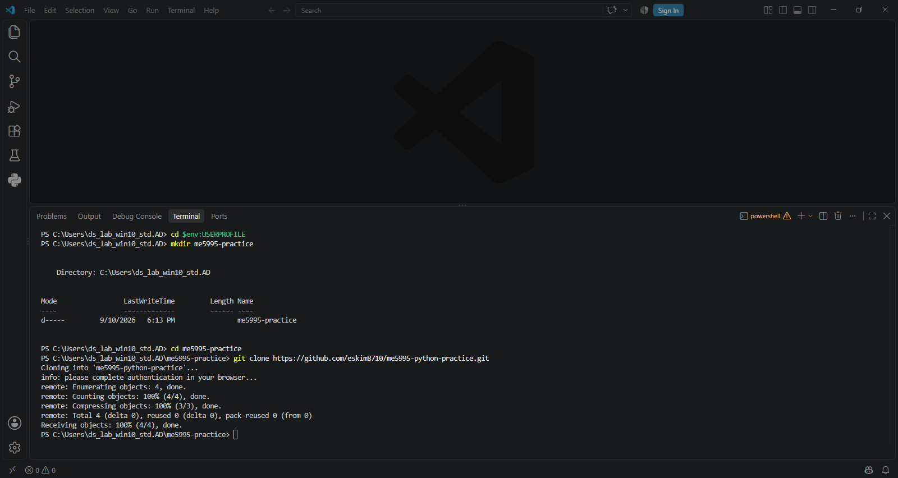

If the destination folder already exists, stop and ask before replacing files.
Do not capture passwords, authentication codes, or the browser callback address.

7. Run:

```powershell
cd me5995-python-practice
git status
code .
```

8. Continue in the project window. Confirm that this is your repository, then
   accept the folder trust prompt. If it opens in **Restricted Mode**, click
   that indicator and select **Trust** in Workspace Trust.

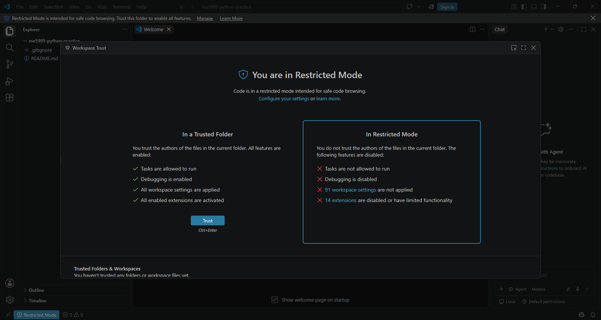

You should see `README.md` and `.gitignore` in Explorer.

## 3. Create and run hello.py

1. Right-click the project folder in Explorer → **New File**.
2. Name it `hello.py`, paste the following, and press **Ctrl+S**:

```python
print("Hello, ME 5995!")
print("My local Python project is running.")
```

3. Open **Terminal → New Terminal** in this project window and run:

```powershell
py -3.13 hello.py
```

You should see both sentences printed in the terminal.

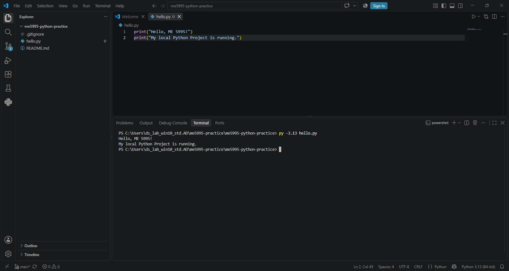

## 4. Select Python and install packages

Run:

```powershell
py -3.13 -c "import sys; print(sys.executable)"
```

With `hello.py` open, press **Ctrl+Shift+P** and select **Python: Select Interpreter**.
Choose Python 3.13 at the path printed above. If it is not listed, choose
**Enter interpreter path → Find** and locate that executable.

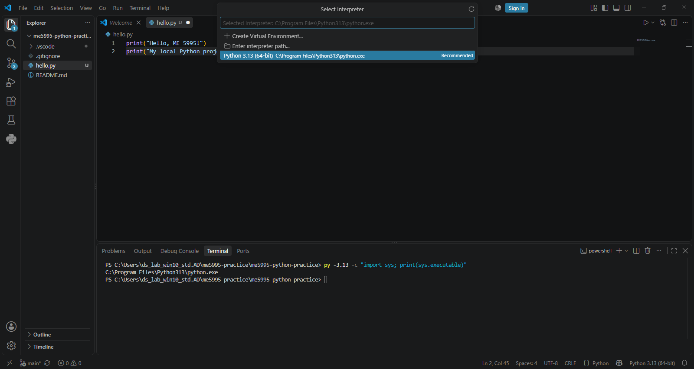

In the terminal, run:

```powershell
py -3.13 -m pip install --user numpy matplotlib
```

Wait for the prompt to return, then run:

```powershell
py -3.13 -c "import numpy, matplotlib; print('Packages are ready.')"
```

You should see `Packages are ready.` Packages already installed may show
`Requirement already satisfied` during installation.

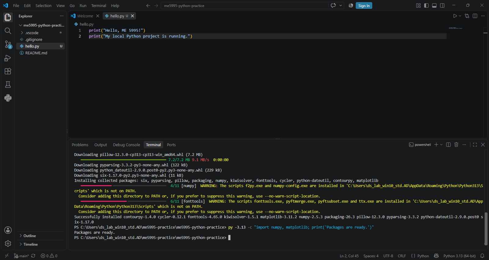

> **Tip — The warning in this screenshot:** The user Scripts folder is not on
> PATH. That affects running tools such as `f2py` directly. This example imports
> packages through Python, so no PATH change is needed for that message. If
> another warning or an error appears, preserve its text for help.

No virtual environment is needed. These packages are shared by projects using
this Python and Windows account. [Virtual environments](optional_venv.md) are
an optional reference for later.

## 5. Run the vibration example

Create `vibration.py` beside `hello.py`, paste this code, and save:

```python
import numpy as np
import matplotlib.pyplot as plt

# Create a synthetic vibration signal.
amplitude = 1.0
frequency = 10.0
time = np.arange(1000) / 1000
acceleration = amplitude * np.sin(2 * np.pi * frequency * time)

plt.plot(time, acceleration)
plt.xlabel("Time (s)")
plt.ylabel("Acceleration (m/s²)")
plt.title("Synthetic vibration signal")
plt.ylim(-2.2, 2.2)
plt.grid(True)
plt.tight_layout()
plt.show()
```

Run:

```powershell
py -3.13 vibration.py
```

A graph window should open. The signal repeats ten times over the 1-second
window and reaches ±1 m/s². This is a made-up signal, not a machine measurement.
The example creates 1,000 samples at 1,000 samples/s; its last timestamp is 0.999 s.

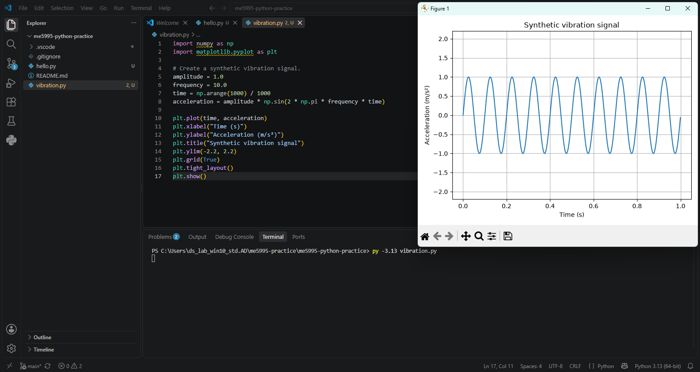

Leave the graph open for the next step. While it is open, the terminal may not
show a new prompt; closing the graph returns control to the terminal.

## 6. Save the graph and add it to README

1. Right-click the project folder in Explorer → **New Folder** → name it `images`.
2. In the graph window, click the disk-shaped **Save** button.
3. Navigate to the project's `images` folder.
4. Choose PNG and save as `vibration.png`.

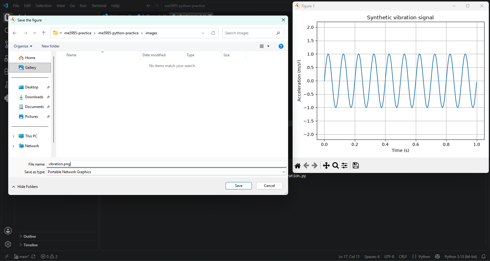

5. In VS Code, click `images/vibration.png` to confirm it opens.
6. Close the graph window.
7. Open `README.md`. Below the existing title, leave a blank line and paste:

```markdown
## Example result

This plot shows a synthetic vibration signal generated with Python.


```

8. Save with **Ctrl+S**.
9. Press **Ctrl+Shift+P** → **Markdown: Open Preview to the Side**.

You should see the text on the left and the rendered graph on the right.

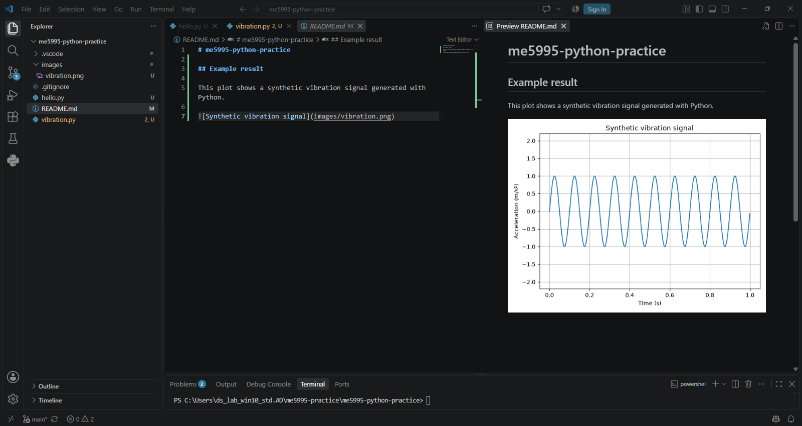

> **Tip — Relative paths:** `images/vibration.png` points to a file inside your
> project. Use that path rather than a `C:\...` path so it also works on GitHub.
> Match spelling and capitalization exactly.

## 7. Record packages and exclude editor settings

1. Create `requirements.txt` next to `README.md`, paste these two lines, and save:

```text
numpy
matplotlib
```

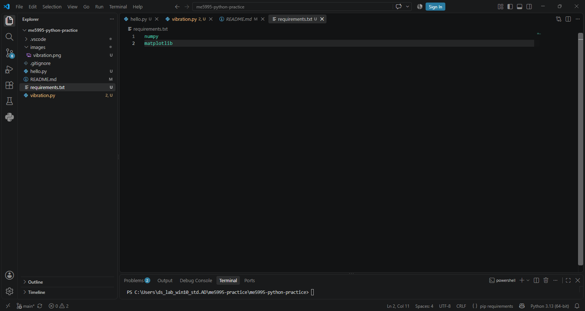

Someone using this project can install its packages with:

```powershell
py -3.13 -m pip install --user -r requirements.txt
```

You do not need to reinstall them now. This short list does not pin exact versions.

2. Open `.gitignore`. Add this at the end if `.vscode/` is not already listed:

```gitignore
# VS Code configuration
.vscode/
```

3. Save. Keep the existing Python ignore rules. Do not exclude `images/` or all
   PNG files: your selected result image belongs in the repository.
4. Run:

```powershell
git status --short
```

Expect modified `.gitignore` and `README.md`, plus new `hello.py`, `vibration.py`,
`requirements.txt`, and `images/`. `M` means modified; `??` means untracked.

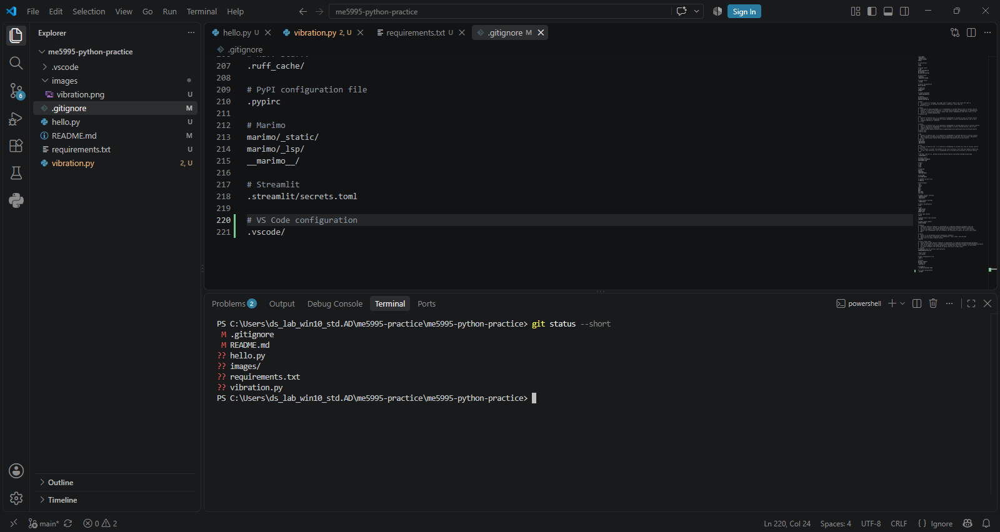

## 8. Set the commit author

Replace the two placeholders below with your name and an email registered to
your GitHub account. Run the commands in your project folder:

```powershell
git config --local user.name "YOUR NAME"
git config --local user.email "YOUR EMAIL"
```

No output is normal. `--local` applies to this repository only. These values
identify the author of a commit; they do not log you in to GitHub.
If you use GitHub's private noreply email, copy your exact address from your
GitHub email settings. Do not include your email-setting screen in captures.

## 9. Add, commit, and push

The following diagram separates files you edit, changes you stage, local
commits, and the copy on GitHub.

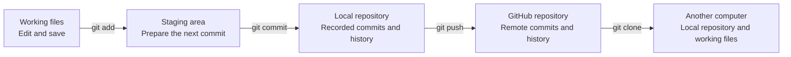
```mermaid
flowchart LR
    W["Working files<br/>Edit and save"] -->|git add| S["Staging area<br/>Prepare the next commit"]
    S -->|git commit| L["Local repository<br/>Recorded commits and history"]
    L -->|git push| R["GitHub repository<br/>Remote commits and history"]
    R -->|git clone| O["Another computer<br/>Local repository and working files"]
```

`git clone` creates a local copy for the first time. Later, `git pull` fetches
remote changes and integrates them into the current branch; it is not a step
needed for this first upload. Saving a file alone does not create a commit or
send anything to GitHub.


Run these commands one at a time from the project folder:

```powershell
git add .
git diff --cached --stat
```

Here, `.` means **the current folder**. Git stages changes there and in its
subfolders, including new, modified, and deleted files. New files excluded by
`.gitignore` are not added. Expect six files in the staged summary, including
the PNG marked as binary (`Bin`). If unrelated files appear, ask before committing.

> **Tip — Select files or folders:** You can use `git add README.md images/`
> to select specific items instead. Files previously staged stay staged, so
> always check the full staged list before committing.

Run:

```powershell
git commit -m "Add Python vibration example and README plot"
```

`-m` supplies the commit message describing the change. Expect a commit ID and
`6 files changed`; your ID will differ from the screenshot.

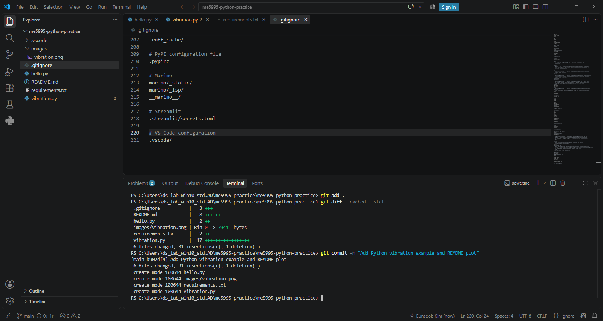

Then run:

```powershell
git push
```

If asked, authenticate with your own GitHub account. Expect `main -> main`.

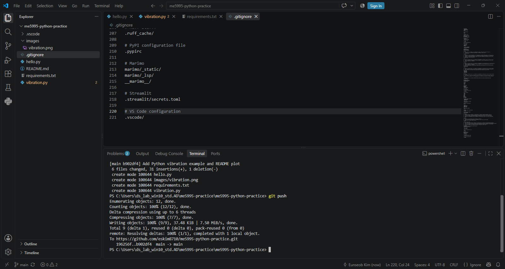

| Action | What it does |
|---|---|
| Save | Writes edits to files on this computer |
| Add | Selects file contents for the next commit |
| Commit | Records the selected contents in local Git history |
| Push | Sends local commits to GitHub |

Open your repository in the browser and refresh. Confirm the files, commit
message, and graph in the README.

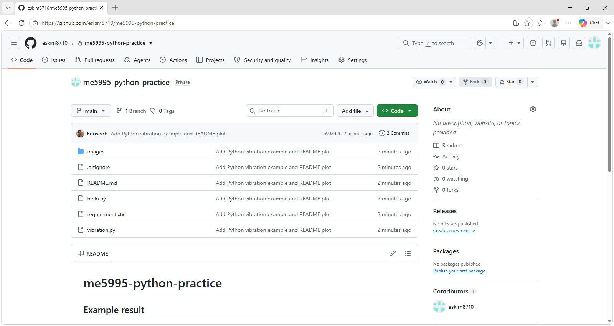

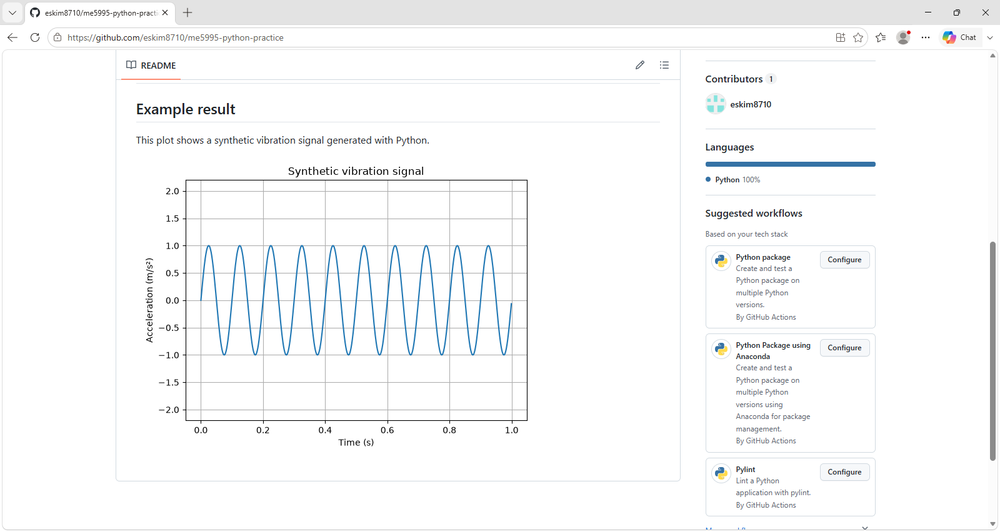

## 10. Change two values and update the result

In `vibration.py`, replace:

```python
amplitude = 1.0
frequency = 10.0
```

with:

```python
amplitude = 2.0
frequency = 5.0
```

Save, then run:

```powershell
py -3.13 vibration.py
```

You should now see five repetitions reaching ±2 m/s².

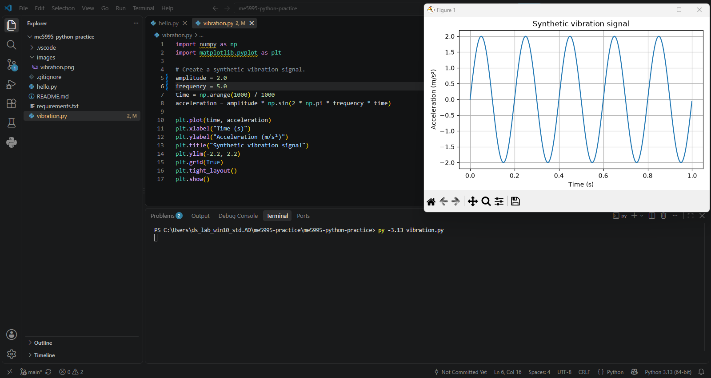

Click the graph's Save button again, save as `images/vibration.png`, and choose
**Yes** when asked to replace it. Running the script alone does not update the PNG.

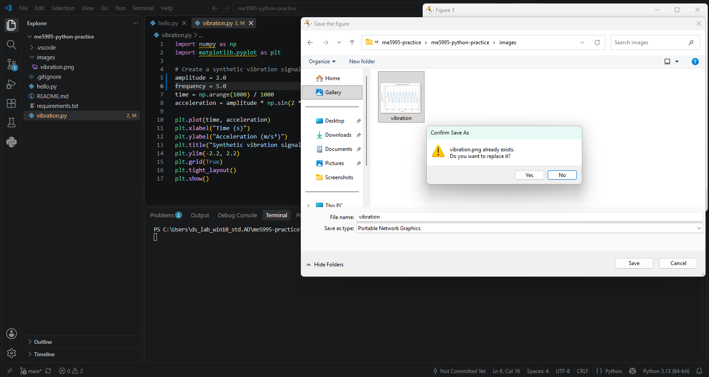

Close the graph. Check the README preview; reopen the preview if it still shows
the old image. The Markdown link does not need to change.

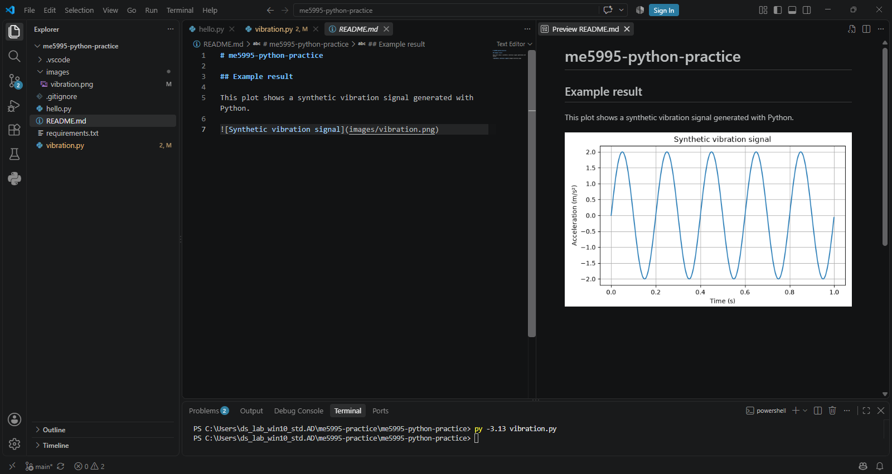

## 11. Save the updated version to GitHub

Run:

```powershell
git status --short
git diff -- vibration.py
```

Expect two modified files: `vibration.py` and `images/vibration.png`. The diff
shows old lines with `-` and new lines with `+`. If the diff opens in a viewer,
press **Q** to return to the prompt.

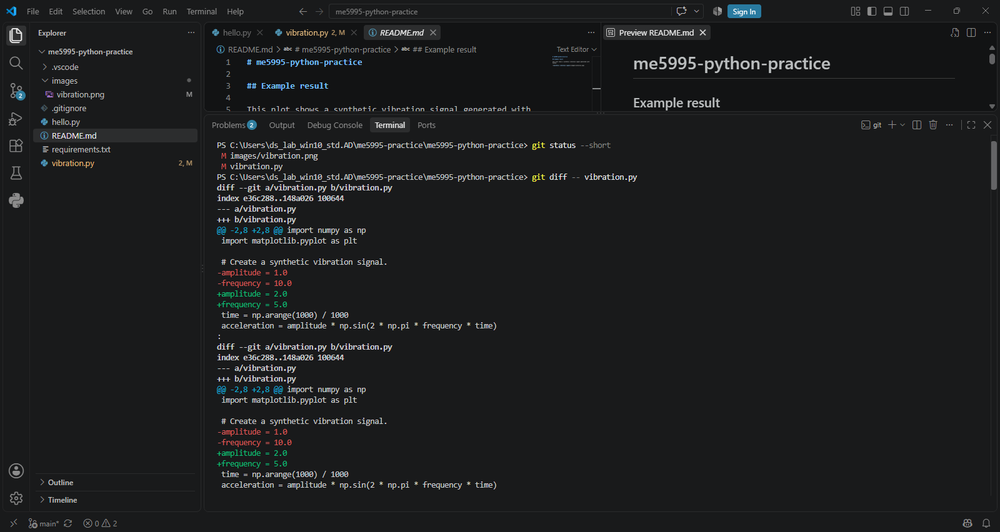

Run one line at a time:

```powershell
git add .
git commit -m "Update vibration amplitude and frequency"
git push
git status
```

Expect `2 files changed` for the commit, a successful push, and:

```text
Your branch is up to date with 'origin/main'.
nothing to commit, working tree clean
```

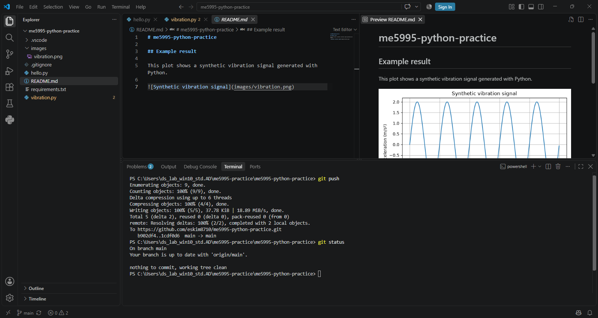

Refresh GitHub and confirm the latest commit and five-cycle graph.

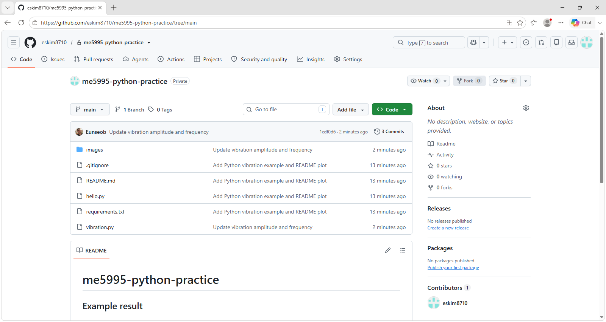

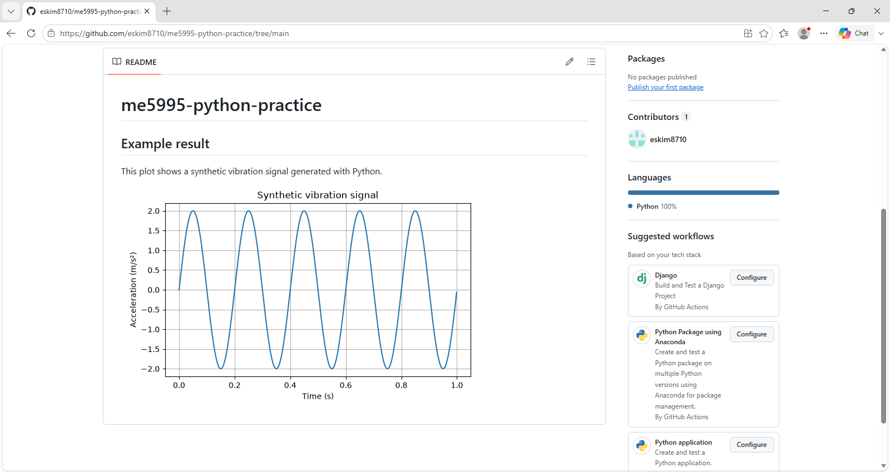

You have finished the project walkthrough. On a shared computer, continue to
[Before Leaving the Classroom](before_leaving.md).

## Continue or finish

Continue with [Practice B](practice_b.md) to download and run a provided project, or use the [command reference](quick_reference.md) for a reminder. On a shared PC, complete [Before leaving](before_leaving.md).

## Tips for later

These are possibilities, not additional tasks.

- **Keep two results:** Save a second image with a different name and add another Markdown image line.
- **Add links:** `[Python website](https://www.python.org/)` creates a clickable link.
- **Explain how to run your project:** Add the installation and execution commands to your README inside code blocks.
- **Save graphs automatically:** Matplotlib can save a figure from code using `savefig`; the manual Save button is enough for this guide.
- **Separate project packages:** See the optional [venv reference](optional_venv.md).

## References

- [Git staging](https://git-scm.com/docs/git-add)
- [pip user installations](https://pip.pypa.io/en/stable/user_guide/#user-installs)
- [VS Code Python selection](https://code.visualstudio.com/docs/python/environments)

Instructor validation: the core Windows classroom workflow was verified with
screenshots on September 14, 2026 using Python 3.13 and user-level NumPy
2.5.3/Matplotlib 3.11.2. Git Credential Manager logout and GitHub browser sign-out
were also verified in the classroom on September 14, 2026.
