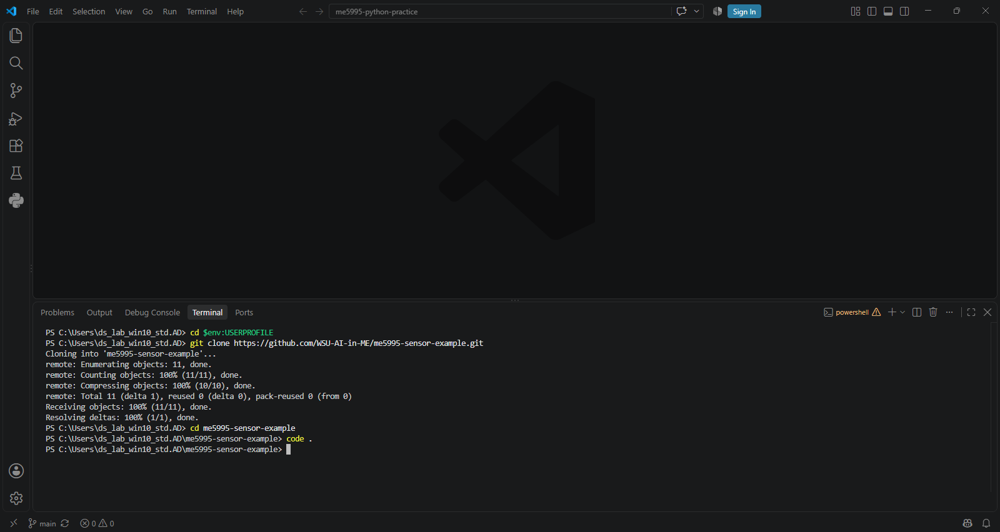
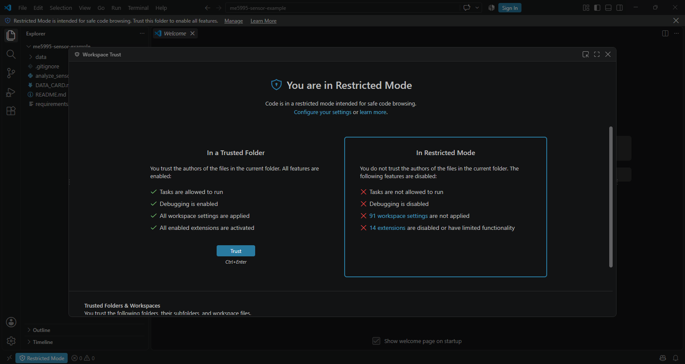
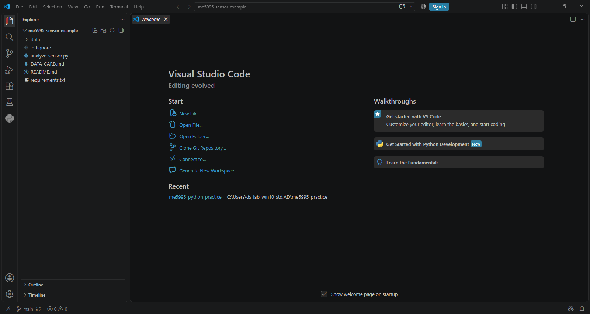
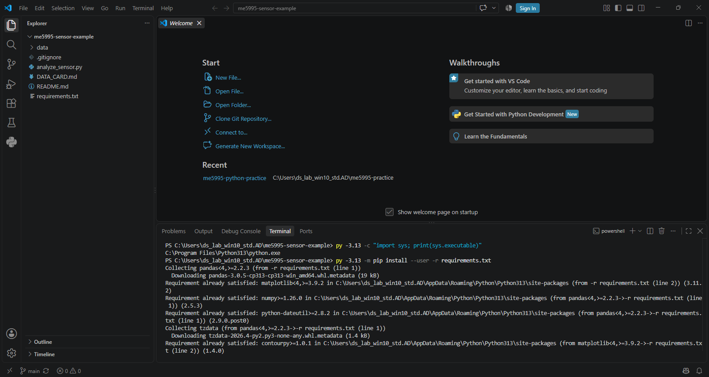
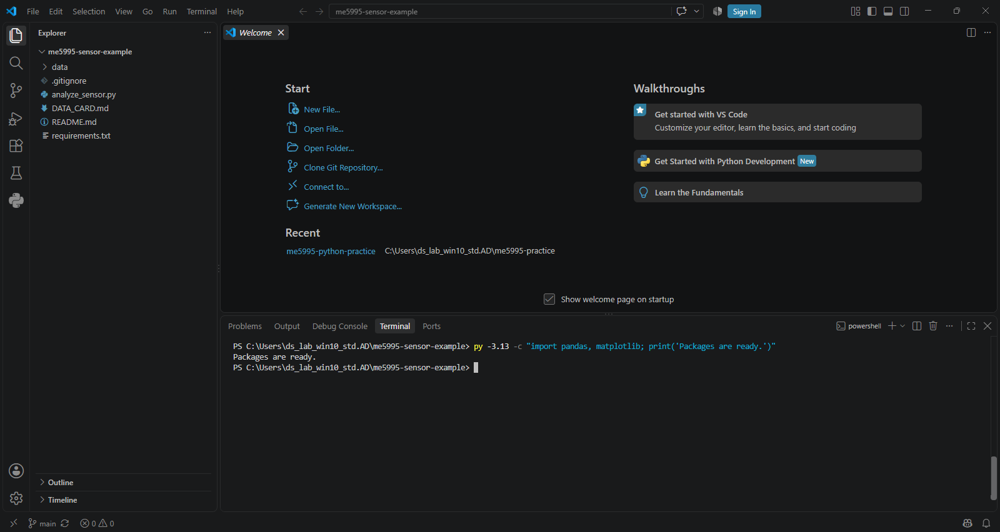
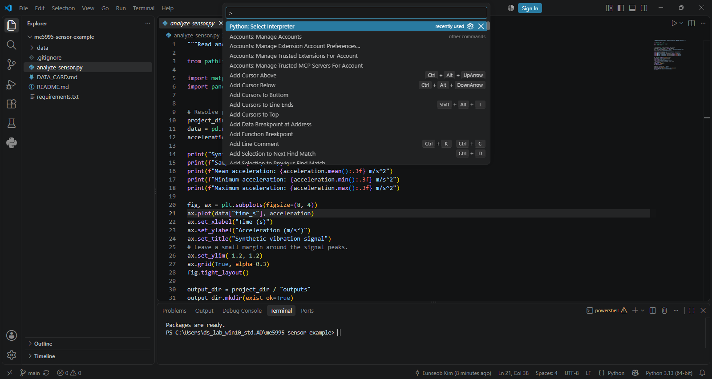
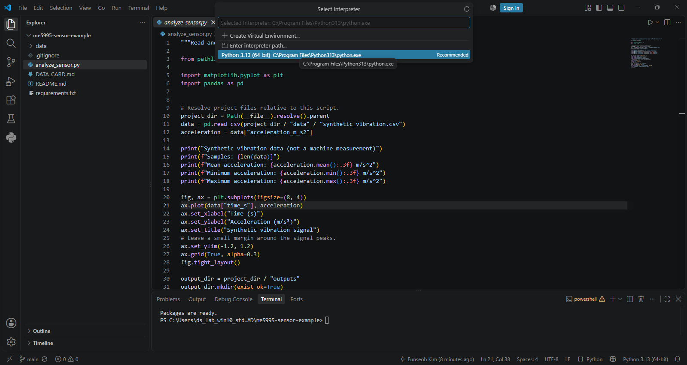
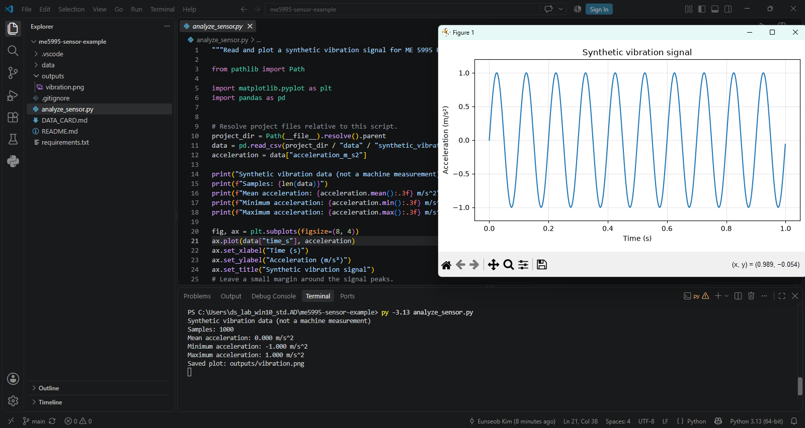
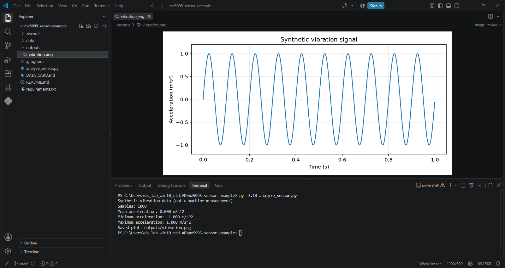

# Practice B — Run an Existing Python Project

**ME 5995 · Optional step-by-step guide**

Follow the steps below to download a ready-made Python project, run it, and
view its output. All code and data are provided. You do not need to write a
program or submit any work.

Use Windows PowerShell. On your own Windows laptop, complete the [Windows setup](windows_setup.md) first. If Practice A is already working, reuse that Python installation; you do not need to repeat Practice A or create another personal repository.
The example uses a made-up vibration signal for demonstration.

This guide uses the installed Python with user-level packages. The commands are for Windows; macOS and Linux setup is not covered. Screenshots show the classroom PC, so your username and Python installation path may differ.

## 1. Download the project

1. Open **VS Code**.
2. Select **Terminal → New Terminal**. Use a **PowerShell** terminal.
3. Run the following command to go to your user folder:

```powershell
cd $env:USERPROFILE
```

4. Copy and run the following lines **one at a time**. Wait for each command to
   finish before entering the next one.

```powershell
git clone https://github.com/WSU-AI-in-ME/me5995-sensor-example.git me5995-sensor-example
```

```powershell
cd me5995-sensor-example
```

```powershell
code .
```

5. Continue in the VS Code window that opens for **me5995-sensor-example**.
   If asked whether you trust the authors, confirm that this is the instructor's
   project and select **Yes, I trust the authors**. If you see **Restricted Mode**
   instead, click it, open workspace trust, and select **Trust** for this folder.

**You should see:** `analyze_sensor.py`, `requirements.txt`, and a `data` folder
in the Explorer panel on the left.

If Git says the destination folder already exists, stop here and ask the
instructor before replacing anything.







## 2. Prepare Python for this project

1. In this project's VS Code window, select **Terminal → New Terminal**.
2. Check that the prompt ends in `me5995-sensor-example>`.
3. Confirm which Python you will use:

```powershell
py -3.13 -c "import sys; print(sys.executable)"
```

**You should see:** the installed Python's path. On the tested classroom PC it
was `C:\Program Files\Python313\python.exe`. Your personal PC's path may differ.
Keep this path for Step 4. No environment creation or activation is needed.

If an error appears in these steps, stop and send the error to the instructor.

## 3. Install the packages

1. In the same terminal, run:

```powershell
py -3.13 -m pip install --user -r requirements.txt
```

This installs missing packages for your user account from the provided list.
Packages already available may show `Requirement already satisfied`. Wait until the prompt
returns; the installation may take a few minutes.

2. Run:

```powershell
py -3.13 -c "import pandas, matplotlib; print('Packages are ready.')"
```

**You should see:** `Packages are ready.`

If installation reports an error or this check fails, send the full message to
the instructor. If a warning appears but the check succeeds, keep the warning
text for review and continue to the example. Do not assume all warnings mean the same thing.





## 4. Select Python in VS Code

1. Click **analyze_sensor.py** in Explorer.
2. Press **Ctrl+Shift+P**.
3. Type **Python: Select Interpreter**, then select that command.
4. Choose **Python 3.13** with the same path printed in Step 2.

If it is not listed, choose **Enter interpreter path → Find** and select
the `python.exe` at the path printed in Step 2.





## 5. Run the provided program

1. Click inside the terminal you used in Step 3.
2. Run:

```powershell
py -3.13 analyze_sensor.py
```

**You should see:** a wave-shaped graph and these lines in the terminal:

```text
Synthetic vibration data (not a machine measurement)
Samples: 1000
Mean acceleration: 0.000 m/s^2
Minimum acceleration: -1.000 m/s^2
Maximum acceleration: 1.000 m/s^2
Saved plot: outputs/vibration.png
```

The wave reaches about **+1 and −1 m/s²**. A mean shown as `-0.000` is also normal.
The program reads the supplied CSV automatically; you do not need to edit it.



3. Close the graph window to return to the terminal prompt.

A copy of the graph is saved as `outputs/vibration.png` inside the project.

## 6. Open the saved result

1. In VS Code Explorer, expand the **outputs** folder.
2. Click **vibration.png** to preview the saved graph.

**You should see:** the same signal shown in the graph window, with peaks near
+1 and -1 m/s² and ten cycles over the one-second sampling window.



You have finished this optional guide. No code changes, commits, pushes, or
submission are needed. You have downloaded a provided project, installed its
requirements, and run it on your computer.

On a shared computer, copy the result to personal storage if you want to keep
it after the computer is reset.

## Using other shared repositories

This walkthrough uses a public course repository. A private repository requires
access granted by its owner and GitHub authentication when cloning. After you
download it, follow that project's README for its Python version, dependencies,
data, and execution command; these may differ from this example.

Cloning downloads files; it does not install Python packages. When a project
provides a requirements file, the pip command in Step 3 installs the listed
packages and their dependencies. Wait for installation to finish before running
the program.

## Further information

You can skip these links when following the steps above.

- [About the supplied synthetic data](https://github.com/WSU-AI-in-ME/me5995-sensor-example/blob/main/DATA_CARD.md)
- [User-level package installation](https://pip.pypa.io/en/stable/user_guide/#user-installs)
- [Installing from a requirements file](https://pip.pypa.io/en/stable/user_guide/#requirements-files)
- [pandas installation](https://pandas.pydata.org/docs/getting_started/install.html)

## Continue or finish

- [Practice A](practice_a.md) covers creating and saving your own project.
- [Command reference](quick_reference.md) summarizes the commands.
- On a shared PC, follow [Before leaving](before_leaving.md) if you signed in.

**Validation:** The complete Windows classroom walkthrough was verified on September 14–15, 2026, including cloning, requirements installation, interpreter selection, GUI execution, automatic image saving, and image preview. This does not establish macOS or Linux compatibility.
