# Windows Setup Guide

### ME 5995 — Local Python Development and Git/GitHub
Wayne State University<br>
**Optional, ungraded self-study**

Work through these activities at your own pace over approximately one month. This is not a Lab or a graded submission. This guide prepares a personal Windows 11 x64 computer for Practice A. Allow approximately 25–45 minutes; download time varies.

**Validation status:** Instructor screenshots reviewed September 10, 2026: Python 3.13.15, pip 26.2.1, Git 2.55.0.windows.5, and VS Code 1.137.0 x64 respond in both standalone PowerShell and the VS Code PowerShell terminal. Microsoft's Python extension 2026.4.0 is installed and enabled. This screenshot review verifies the personal-PC setup checks, not the classroom PC or project environments.

## Where your code runs

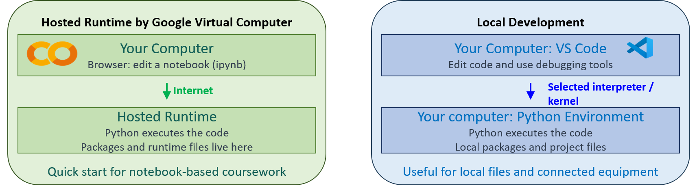

With a Colab hosted runtime, your browser edits the notebook while Python runs
on Google's hosted computer. In this local workflow, VS Code edits your files
and Python runs on your own computer. These practices use `.py` scripts and a
Python interpreter; a notebook kernel is not needed.

## 1. Choose your starting point

- **Personal Windows PC:** Follow the installation steps below. You need internet access and permission to install software.
- **Classroom PC:** Skip installation. Check the installed tools using Section 5 and the Extensions view. Report missing tools to the instructor. Do not shut down or restart a classroom PC.

Use PowerShell for the commands in this guide. Open it from Start; administrator mode is not needed for routine checks. Enter commands without copying the prompt text. The Python interpreter runs code; VS Code edits files; its Python extension connects the editor to Python; Git records project history.

## 2. Install Python 3.13.15

1. Open the official [Python 3.13.15 release page](https://www.python.org/downloads/release/python-31315/). In the **Files** table, select **Windows installer (64-bit)**. Use this direct installer, rather than the Install Manager button or an embeddable package.
2. Run the downloaded installer. On the first screen, enable **Add python.exe to PATH** and select **Install Now**. The captured personal-PC installation also selects **Use admin privileges when installing py.exe** for the launcher.
3. After installation succeeds, close the installer and open a new PowerShell window. Run:

```powershell
py -3.13 --version
py -3.13 -c "import sys; print(sys.executable)"
py -3.13 -m pip --version
```

Expect `Python 3.13.15`, an executable path, and pip information. Record the actual outputs. If the version differs or `py` is unavailable, preserve the output for review before continuing. This direct installation does not use a `py install` command.

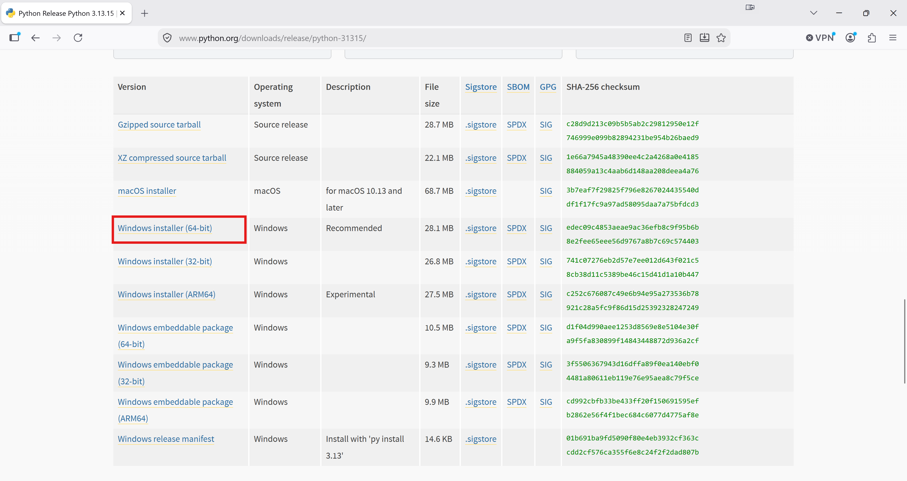

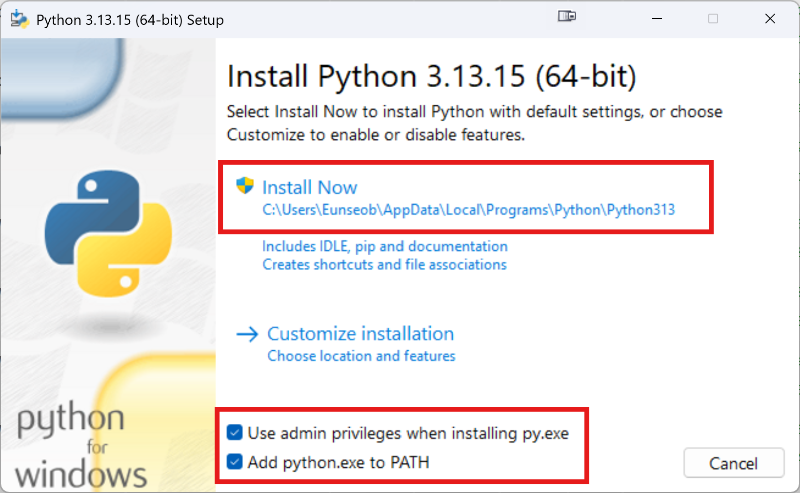

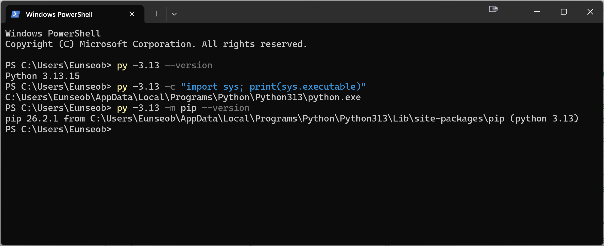

This route follows the [Python 3.13 full-installer documentation](https://docs.python.org/3.13/using/windows.html#the-full-installer). The walkthrough uses the installed Python and user-level packages on both personal and classroom PCs.

## 3. Install Git

Download **Git for Windows/x64 Setup** from the [official Git Windows installation page](https://git-scm.com/install/windows). Run the installer and approve its installation prompt if required.

Keep the standard installation location and default options unless the following choices need adjustment:

- Make Git available from the command line and other applications, so PowerShell and VS Code can find it.
- Keep Git Credential Manager enabled if that choice appears. Its presence does not mean you are signed in to GitHub.
- Select Notepad as Git's editor to match this walkthrough. Practice A will supply commit messages in the terminal.

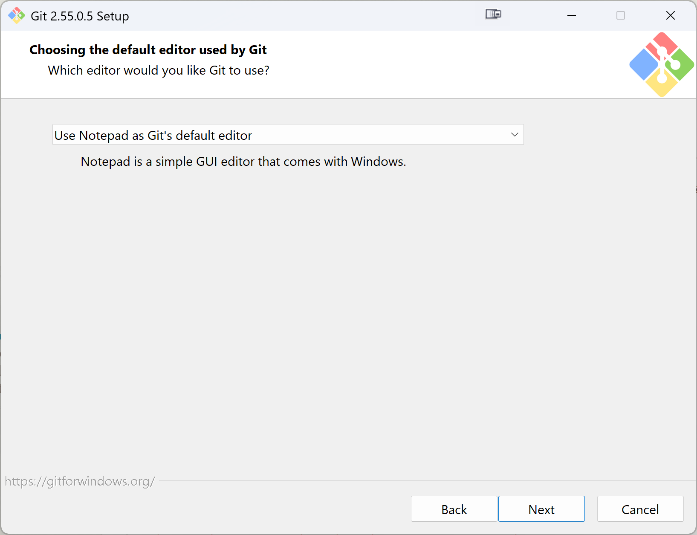

Continue through the other wizard pages using the defaults. The captured PATH choice is **Git from the command line and also from 3rd-party software**, and the credential helper is **Git Credential Manager**. Installer options are represented in the [Git for Windows installer source](https://github.com/git-for-windows/build-extra/blob/main/installer/install.iss).

Close and reopen PowerShell, then run:

```powershell
git --version
```

Expect a Git version, rather than a command-not-found error. Git installation does not create a GitHub account. Author name/email settings and GitHub authentication will be handled separately in Practice A.

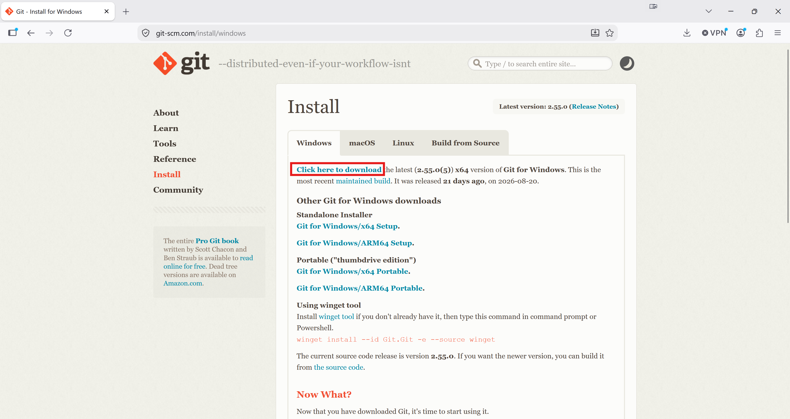

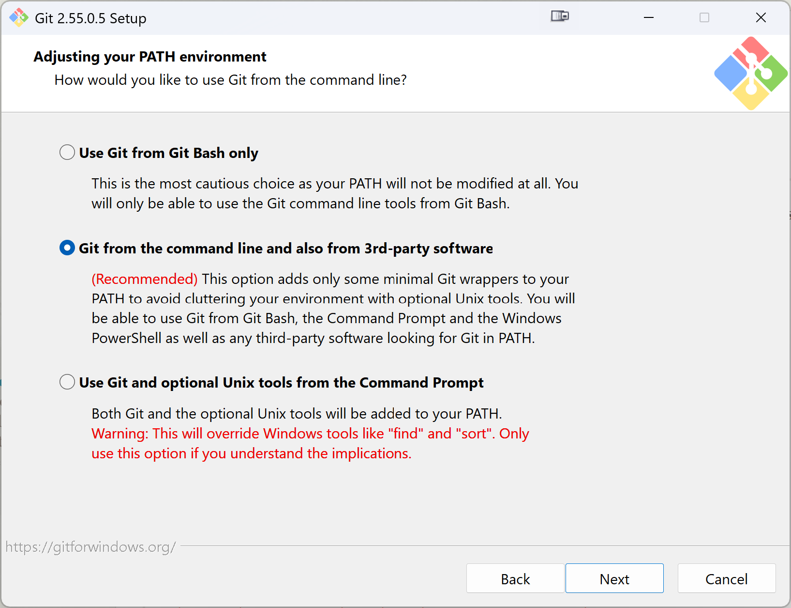

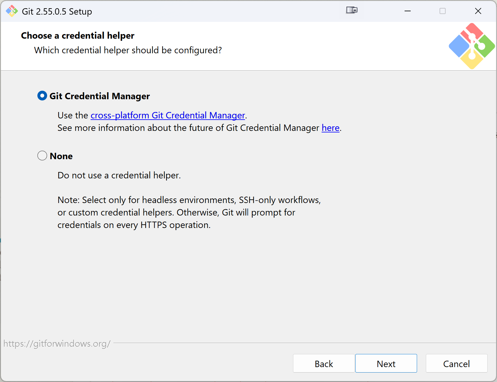

## 4. Install VS Code and the Python extension

1. Use the [official VS Code download page](https://code.visualstudio.com/download) and select **Windows User Installer, x64**. User installation suits this personal-PC workflow even when administrator rights are available.
2. Run the installer normally. Keep **Add to PATH** enabled. The screenshot also enables both **Open with Code** context-menu entries and registration as an editor; these are convenient optional choices. Finish installation and launch VS Code. “Requires shell restart” means reopening the terminal, not restarting the PC.
3. Open Extensions with **Ctrl+Shift+X**. Find **Python**, published by **Microsoft**, extension identifier `ms-python.python`, and install it. If it is already installed, check that it is enabled. Record that state rather than assuming the reinstall removed earlier extensions.

The [Windows setup documentation](https://code.visualstudio.com/docs/setup/windows) describes User setup and PATH behavior. The [Python extension listing](https://marketplace.visualstudio.com/items?itemName=ms-python.python) identifies the extension. The extension does not replace the Python runtime installed earlier.

No account sign-in is needed for these setup checks. Project folders, interpreter selection, and script execution are covered in Practice A; the Jupyter extension belongs to the later optional notebook activity.

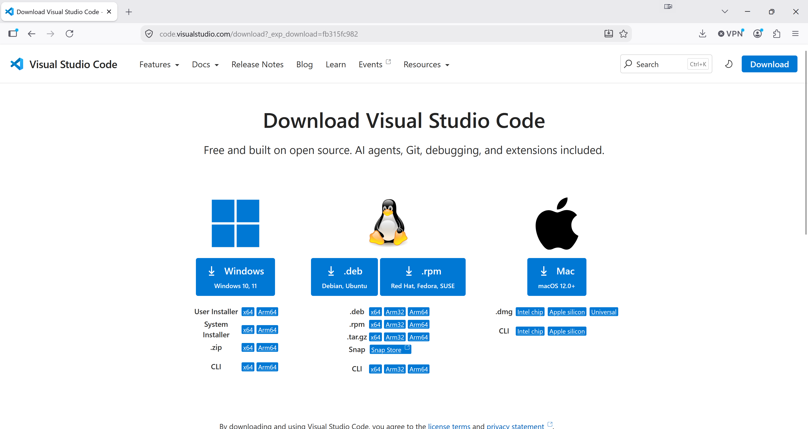

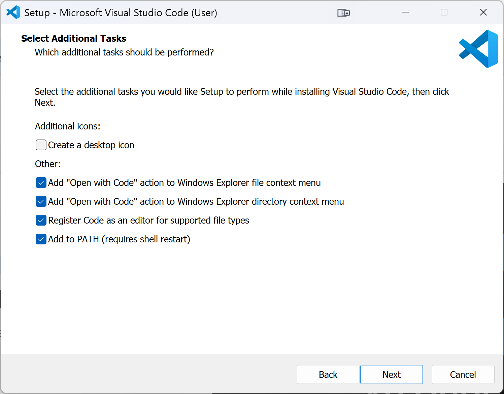

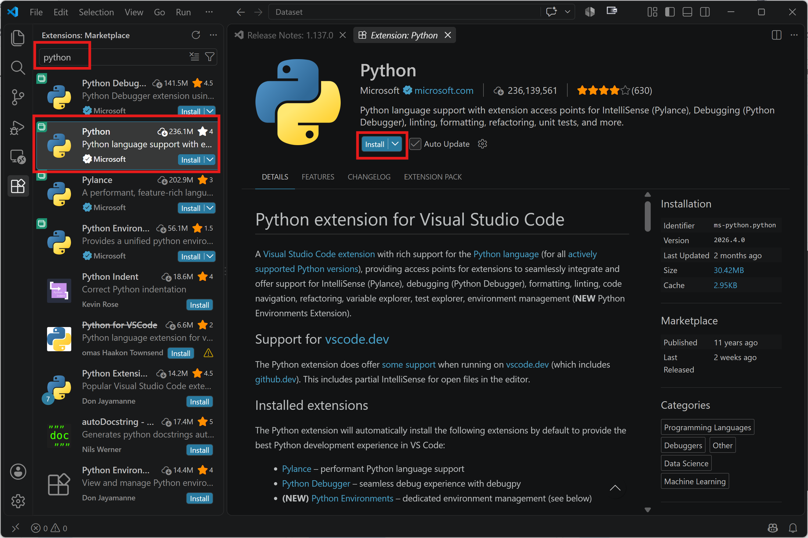

The screenshot shows the step before installation. After clicking Install, confirm that the extension is enabled; an installed extension normally offers Disable and Uninstall controls.

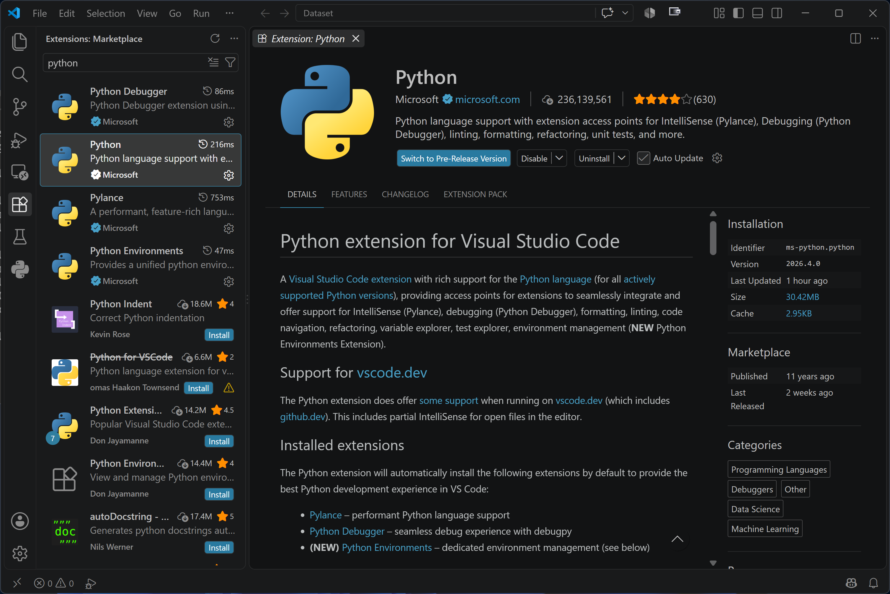

## 5. Verify the setup

Close and reopen PowerShell after installation, then run:

```powershell
py -3.13 --version
py -3.13 -c "import sys; print(sys.executable)"
py -3.13 -m pip --version
git --version
code --version
```

Record the actual outputs; version numbers need not match screenshots exactly. `code --version` should display version information, including the architecture. If a command is missing, first retry in a newly opened PowerShell window. If it still fails, preserve the exact error and request help rather than repeatedly reinstalling tools.

Open VS Code, choose **Terminal → New Terminal**, and select a PowerShell terminal if another shell opens. Repeat the Python and Git checks there. If only that terminal fails, close and reopen VS Code to refresh its environment.

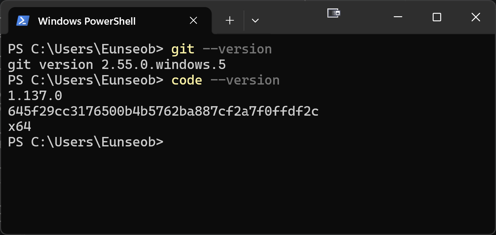

The Python and pip output is shown in Section 2. Your Windows username and installation path will differ from those in the screenshots.

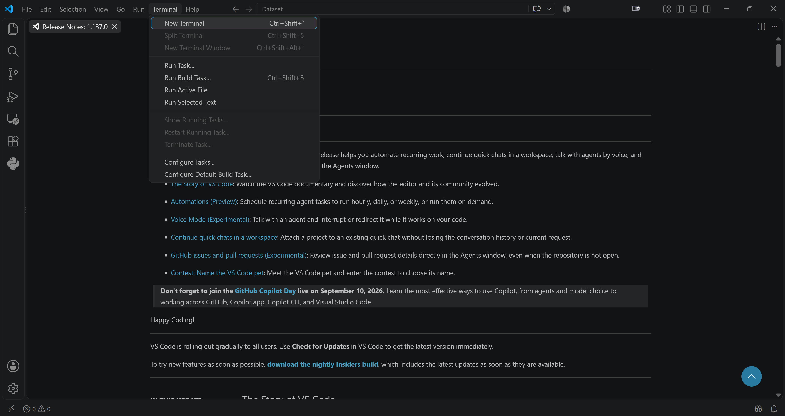

Run these commands inside the VS Code PowerShell terminal:

```powershell
py -3.13 --version
py -3.13 -c "import sys; print(sys.executable)"
py -3.13 -m pip --version
git --version
code --version
```

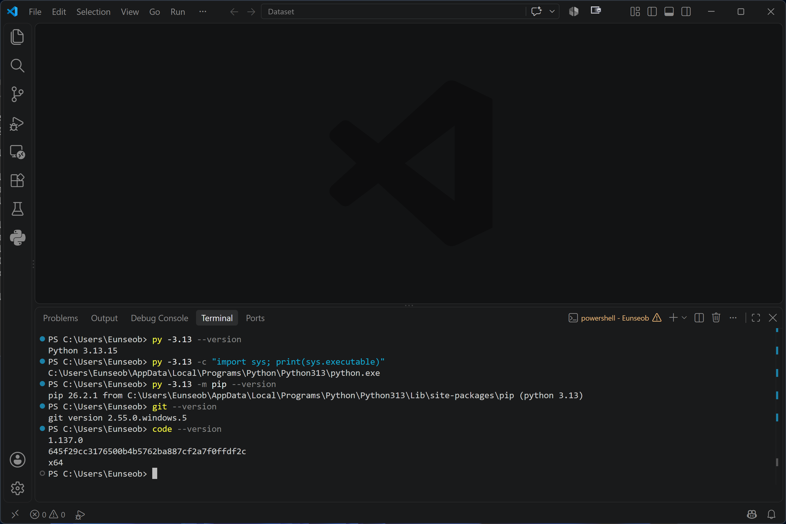

### Expected setup results

- Python 3.13 and pip respond successfully.
- Git responds in PowerShell.
- VS Code starts and its command is available.
- Microsoft's Python extension is installed and enabled.
- Python and Git also respond in the VS Code PowerShell terminal.

You can pause here. Continue with [Practice A](practice_a.md) to create your own project, or [Practice B](practice_b.md) to run the provided project. Both use the same installed tools. No virtual environment or execution-policy change is required in the main guide. [Virtual environments](optional_venv.md) are a separate optional reference.
